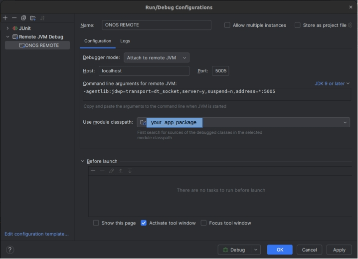

ONOS Controller

# ONOS Controller Deploy

## Docker Image
Launch the ONOS controller with the following command:
```
docker run -d \
  -p 6640:6640 \
  -p 6653:6653 \
  -p 8101:8101 \
  -p 8181:8181 \
  -p 9876:9876 \
  -p 5005:5005 \
  -e JAVA_DEBUG_PORT="0.0.0.0:5005" \
  -e ONOS_APPS="org.onosproject.drivers.bmv2,org.onosproject.pipelines.basic,org.onosproject.hostprovider,org.onosproject.lldpprovider,org.onosproject.linkdiscovery,org.onosproject.proxyarp,org.onosproject.hostprobingprovider,org.onosproject.drivers.p4runtime,org.onosproject.drivers.stratum,org.onosproject.drivers,org.onosproject.gui2" \
  --name onos_container \
  onosproject/onos:2.7-latest debug
```
5005 port is used for debugging, and can be removed if not needed. Remove also the `-e ONOS_OPTS` line.

# ONOS Application basic structure

The basic structure of an ONOS application can be started using the ONOS command:
```
onos-create-app app
```

The following project structure must be followed to avoid errors in the ONOS application:
```
rootapplication
|_src
|   |_main
|   |   |_java
|   |       |_org
|   |           |_<app package>
|   |               |_app
|   |                   |_<your_code>.java (main class/classes)
|   |                   |_<your_code_interface>.java (interfaces)
|   |                   |_package-info.java
|   |_test
|       |_java
|           |_org
|               |_<app package>
|                   |_app
|                       |_<your_code_test>.java (test classes)
|_target (generated .oar files)    
|_pom.xml

```

The basic template for the main Java class, test class and pom.xml file is shown in the basic template directory.
You can follow the template to check the minimal requirements for the ONOS code to work.
It is recommended to use IntelliJ IDEA to develop the ONOS applications, as it also allows to debug the code in the ONOS controller.

The ONOS debug configuration can be seen in the following image:



# Basic Pipeline
TODO
## Necesary ONOS Apps
From the docker ONOS command:
```
"org.onosproject.drivers.bmv2,org.onosproject.pipelines.basic,org.onosproject.hostprovider,org.onosproject.lldpprovider,org.onosproject.linkdiscovery,org.onosproject.proxyarp,org.onosproject.hostprobingprovider,org.onosproject.drivers.p4runtime,org.onosproject.drivers.stratum,org.onosproject.drivers,org.onosproject.gui2"
```
## Connection of a switch to the controller
Connecting a switch to the ONOS controller is done through the ONOS REST API. It consists on adding devices to the configuration, specifying the management address and the necessary driver to communicate with the switch. In this case, P4 switches based on the BMv2 software switch need BMv2 drivers, such as stratum-bmv2 and bmv2. This drivers must be activated in the ONOS apps in order to be able to connect the switch to the controller.

The REST API call to add a device to the controller is as follows:
```
curl --fail -sSL --user <onos_user>:<onos_pswd> --noproxy <onos_ip> -X POST -H 'Content-Type:application/json' http://<onos_ip>:8181/onos/v1/network/configuration -d @/<docker_directory>/onos-netcfg.json
```
Where the `onos-netcfg.json` file contains the configuration of the switch, such as the management address and the driver to use. An example of the configuration file is:

```
{
    "devices": {
        "device:<name>": {
            "basic": {
                "managementAddress": "grpc://<device_addr>:<device_port>?device_id=<int_id>",
                "driver": "stratum-bmv2",
                "pipeconf": "org.onosproject.pipelines.basic"
            },
            "ports": {
                "1": {
                    "number": 1,
                    "name": "<intf_name>",
                    "enabled": true,
                    "removed": false,
                    "type": "copper",
                    "speed": 10000
                },
                "..."
            }
        }
    }
}
```

**This configuration and connection with the controller is already implemented in the stratum_bmv2.py file.**


# Advanced Pipeline deployment
Design of a custom P4 pipeline, compilation and deployment in ONOS controller.
This is a future work, but the idea is to create a custom P4 pipeline, compile it and deploy it in the ONOS controller. This must work with P4Runtime, and use the correct Protobuf specifications, including pipeconf code on a custom ONOS application.


